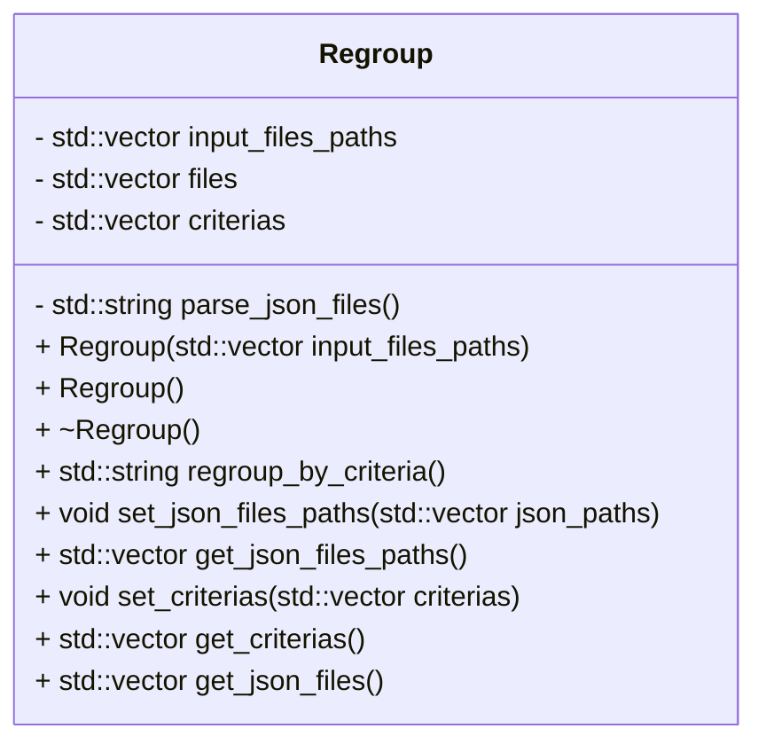

# Regroup JSON Library

The `Regroup` library allows you to process and regroup JSON data based on specified criteria. It provides methods to load, parse, and reorganize the content of JSON files according to the attributes you define. It reads JSON files and create an _'out'_ version of the files structured according to criterias and specifications.

This library relies on the following dependencies:

* nlohmann/json: A popular JSON parser for C++;
* C++17 Filesystem API (standard with modern C++ compilers like GCC 8+).

The `main.cpp` shows an example of two JSON files being parsed and regrouped according to these criteria: `{"shape", "material"}`. It finally prints the paths of the JSON files as an example of accessing class attributes.

## Class diagram



## Running

To run the project, make sure you have Cmake & make installed.

Go to build directory and run make:

Linux (recommended):
```
mkdir build
cd build
cmake ..
make
./regroup-bodies.out
```

MinGW
```
mkdir build
cd build
cmake .. -G "MinGW Makefiles"
mingw32-make
./regroup-bodies.exe
```

Or use proper IDE like Visual Studio.


_by Maxence A._
